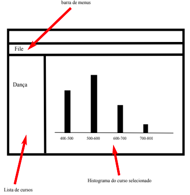

# Projeto final de Programação Orientada a Objetos

### Descrição 

O trabalho final da disciplina constará de um problema de programação que deverá ser feito em duas linguagens, sendo uma delas Java. **O trabalho será individual ou em dupla** e abordará um tema escolhido pelo aluno em comum acordo com o professor. Os alunos terão um tempo de quatro aulas (duas semanas) para realizar a atividade.

### Entregável

O entregável será formado por

1. Código fonte do projeto em formato `zipfile`.
2. Um arquivo de documentação (markdown) com apresentação do diagrama de classes e particularidades do projeto, como o uso de algum tipo de padrão de projeto. Procure também chamar atenção para as diferenças encontradas nas duas linguagens, especialmente no que diz respeito ao paradigma de orientação a objetos.

O envio do entregável deve ser feito pela plataforma Google Classroom.

### Critérios de avaliação

A composição da nota final levará em consideração as seguintes partes:

1. **[2 ptos]** Participação nas reuniões de acompanhamento.

2. **[2 ptos]** Qualidade da documentação.

3. **[2 ptos]** Qualidade da interface gráfica (boa utilização dos recursos oferecidos pelo _framework_ adotado).

4. **[2 ptos]** Qualidade do código (baixo acoplamento, elevada coesão, boa documentação, utilização de padrões de projeto).

5. **[2 ptos]** Arguição oral.

### Temas sugeridos

- Apresentação de dados de Covid-19 no estado de SE.

- Apresentação dos dados do Campeonato Brasileiro de futebol.

- Apresentação dos resultados do SISU na UFS.

- Apresentação dos dados meteorológicos do INMET.

### Proposta do projeto

Cada aluno/dupla deve apresentar uma proposta de projeto em formato _markdown_ descrevendo o tema de seu trabalho, um esboço da tela, ou telas, e uma descrição do que deve ser feito. Veja o modelo a seguir.

#### Modelo de proposta do projeto

#### Tema do projeto

- Apresentação dos resultados do SISU na UFS.

#### Tela da aplicação

#### Descrição do aplicativo

1. O usuário seleciona no menu `File` um arquivo texto com os resultados do SISU na UFS em um determinado ano. 

2. Ao abrir o arquivo, a lista à esquerda deve ser preenchida com os nomes dos cursos ordenados em ordem alfabética.

3. Ao clicar no nome de algum curso, a aplicação calcula o histograma com a distribuição da quantidade de candidatos por faixa de pontuação.
