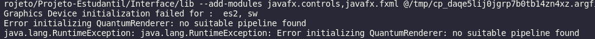
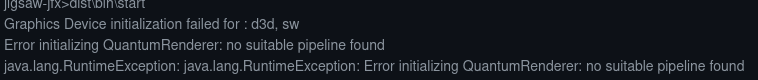
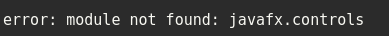

# Tema do projeto

- ### **Apresentação de resultados do SISU na UFS.**

#### Descrição do aplicativo

1. O usuário ira pesquisar um nome de um curso.

2. O programa irá gerar o gráfico do curso pesquisado a partir de dados da base de dados local.

   ***

   ### Outros arquivos

   -`layout.fxml`: Arquivo base para interface gráfica JavaFx devido a diversos erros não solucionados foi finalizado.

   #### Alguns Erros Ocorridos

   
   
   

   ***

   

   

   
